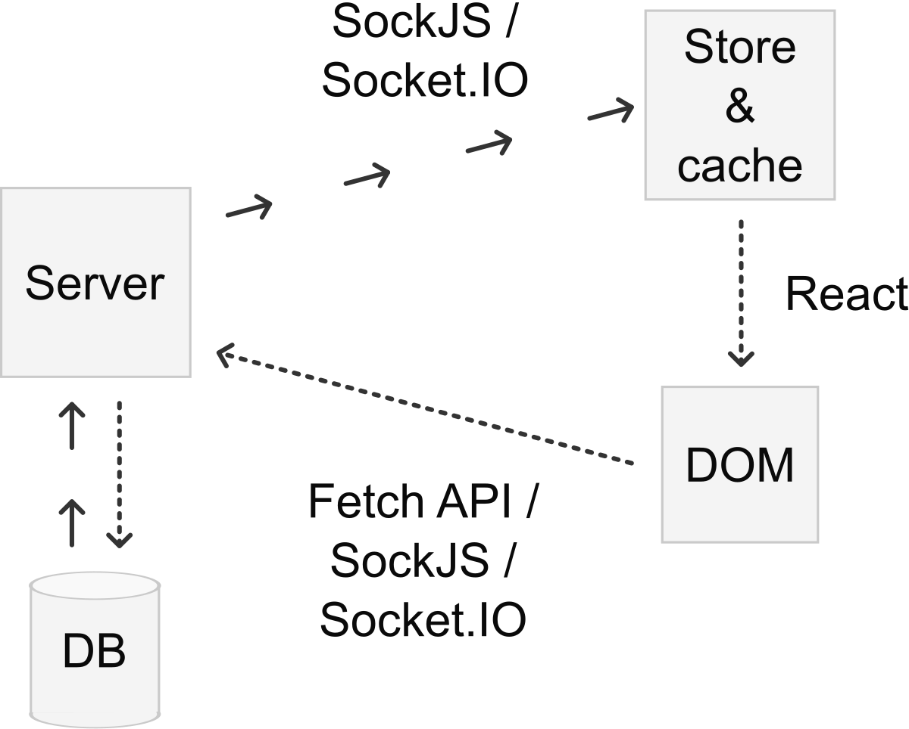

# Yksinkertainen mutta tehokas arkkitehtuuri

### SockJS / Socket.IO

* Data-liikenne _palvelin_ → _selain_

### React

* Data ruudulle

### Fetch API / SockJS / Socket.IO

* Data-liikenne _selain_ → _palvelin_
* Fetch API:n asynkronisuus ja virhekoodit 👍

### Tietokanta

* CouchDB / PouchDB / RethinkDB tms. joka tukee muutosten kuuntelua

### Palvelin

* Node.js

